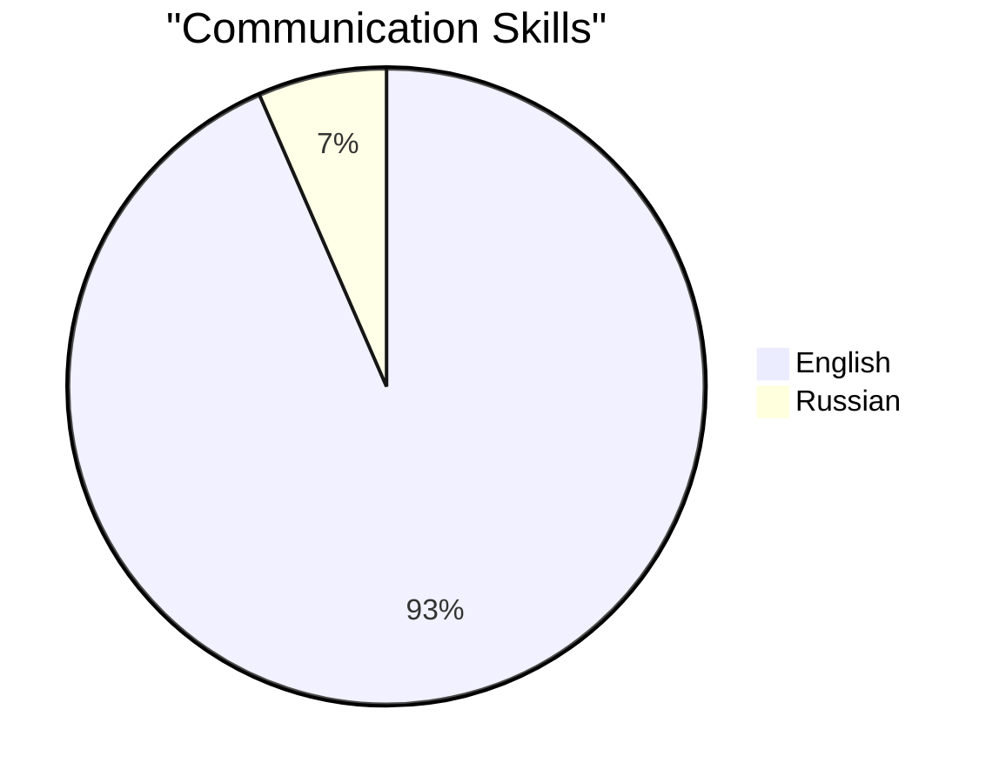

<div align="center">

# 🌌 M A R L A

[](https://git.io/typing-svg)


[](#)
[](https://discord.gg/WJUheEQtuS)
[](https://bsky.app/profile/hxch.bsky.social)

</div>

## 🌟 About Me

Fueled by innovation since my coding journey began at age 8, I've developed a diverse portfolio spanning applications, websites, and cutting-edge web3 solutions. From advanced security tools to groundbreaking applications, ODIN AI stands as my crowning achievement—pushing the boundaries of what's possible in artificial intelligence.

## 🛠️ Tech Stack

```yaml
OS        : Windows 11 Professional
Browser   : Firefox (Custom Fork)
IDE       : My Own Proprietary Development Environment
```

## 💻 Core Technologies

<div align="center">

[](https://skillicons.dev)

*Leveraging my custom programming language for specialized solutions*

</div>

## 🔧 Expertise

<div align="center">


</div>

## 🌐 Language Proficiency



## 🎯 Focus Areas

- 🔒 Advanced Security Systems
- 🤖 AI/ML Development
- 🌐 Network Architecture
- 🎮 Game Security & Development
- 🔬 Vulnerability Research
- 🛠️ Custom Language Development

<div align="center">

```
⠀⠀⠀⠀⠀⠀⠀⠀⠀⠀⠀⠀⠀⠀⠀⣠⣤⣤⣤⡄⠀⠀⠀⠀⠀⠀⠀⠀⠀
⠀⠀⠀⠀⠀⠀⠀⠀⠀⠀⠀⠀⣀⣴⣿⣿⣿⠟⠁⠀⠀⠀⠀⠀⠀⠀⠀⠀⠀
⠀⠀⠀⠀⠀⠀⠀⠀⠀⠀⢐⣶⠿⠿⣿⣿⠋⠀⠀⠀⠀⠀⠀⠀⠀⠀⠀⠀
⠀⠀⠀⠀⠀⠀⠀⠀⠀⠀⣿⡇⣾⣷⠘⠃⠀⠀⠀⠀⠀⠀⠀⠀⠀⠀⠀⠀⠀
⠀⠀⠀⠀⠀⠀⠀⠀⠀⣰⣿⣿⣮⣥⣾⣷⣿⡿⠶⠞⠲⠂⠀⠀⠀⠀⠀⠀⠀
⠀⠀⠀⠀⠀⠀⠀⠀⣈⣾⣿⣿⣿⣿⣿⣿⣿⣿⡄⠀⠀⠀⠀⠀⠀⠀⠀⠀⠀
⠀⠠⣆⣄⣢⣂⠄⢠⣾⣿⣿⣿⣿⣿⣿⡿⣣⣥⡘⣶⡀⠀⠀⠀⠀⠀⠀⠀⠀
⠀⠀⠀⠙⢮⣿⡗⣾⣿⣿⢏⣿⣿⣿⣿⣿⣿⣿⣧⢸⣧⠀⠀⠀⠀⠀⠀⠀⠀
⠀⠀⠀⠀⠀⠿⣸⣿⣿⢏⣾⣿⣿⣿⣿⣿⣿⣿⣿⡿⠋⠀⠀⠀⠀⠀⠀⠀⠀
⠀⠀⠀⠀⠀⠀⠻⢭⣥⣾⣿⣿⣿⣿⣿⣿⣿⣿⣿⡗⠀⠀⠀⠀⠀⠀⠀⠀⠀
⠀⠀⠀⠀⠀⠀⠀⣠⡟⠿⠛⠛⠛⠉⠁⠉⠉⠙⢟⡃⠀⠀⠀⠀⠀⠀⠀⠀⠀
⡟⣿⣧⣤⣼⢄⣼⣿⣠⣀⣄⣤⢺⣣⣦⠟⠛⠛⠛⢻⣄⣄⣀⠤⣀⣄⣠⡔⢳
⠁⠀⡀⠀⠀⠋⣸⢹⡃⠀  4⠀⢼⣿⠀ 4⠀⠈ ⠉⠈ ⠏⣓⢀⣠⣤⣴⠏
⠩⠿⠶⠺⠉⠉⠉⠉⠉⠉⠉⠉⢙⣿⠛⠊⠓⠉⠓⠋⠉⠉⠉⠉⠉⠉⠀⠀⢠
```

---

<i>Note: Direct collaboration requests are not accepted.</i>

</div>
