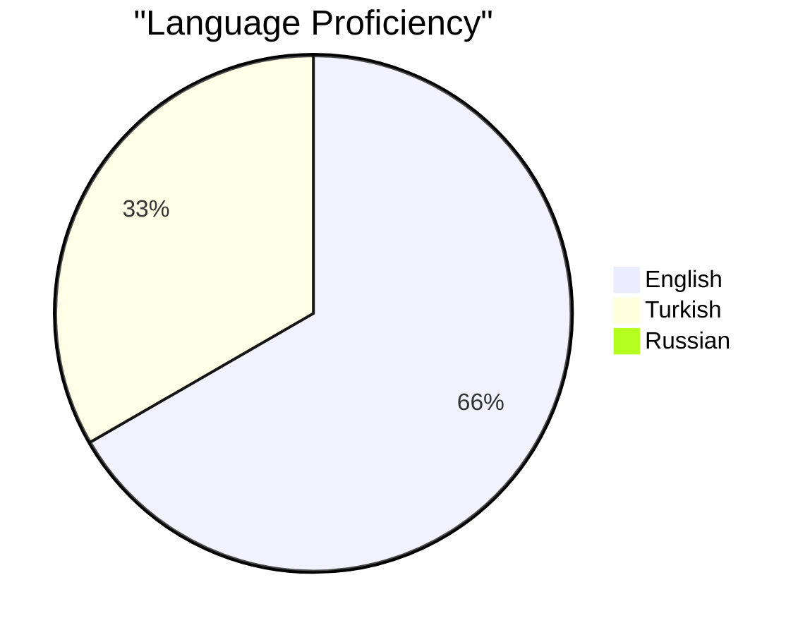

# Welcome to the Future 🚀

<div align="center">
  
  
  

  [](https://discord.gg/your-server)
  [](https://twitter.com/your-handle)
  
  *Transforming Ideas into Reality*
</div>

## 💫 About Me

Fueled by a passion for innovation and a coding journey that started at age 8, I've crafted a diverse array of applications, websites, and cutting-edge web3 solutions. From creating cheats and bots to developing groundbreaking apps and beyond, my proudest achievement remains ODIN AI—a testament to my relentless pursuit of pushing technological boundaries.

## 🛠️ Tech Stack & Environment

```yaml
OS: Windows 11 Professional
Browser: Firefox Forked browsers
IDE: Visual Studio Code
```

## 🔧 Technical Expertise

<div align="center">


</div>

## 🌐 Languages



## 💻 Programming Arsenal

<div align="center">
  <b>While my public projects showcase Python, C, and C++, my private ventures leverage my custom programming language for specialized solutions.</b>
  <br><br>
  
  
  
  
  
  <br>
  <i>44 everywhere ;)</i>
</div>

<div align="center">
  
```
⠀⠀⠀⠀⠀⠀⠀⠀⠀⠀⠀⠀⠀⠀⠀⣠⣤⣤⣤⡄⠀⠀⠀⠀⠀⠀⠀⠀⠀
⠀⠀⠀⠀⠀⠀⠀⠀⠀⠀⠀⠀⣀⣴⣿⣿⣿⠟⠁⠀⠀⠀⠀⠀⠀⠀⠀⠀⠀
⠀⠀⠀⠀⠀⠀⠀⠀⠀⠀⢐⣶⠿⠿⣿⣿⠋⠀⠀⠀⠀⠀⠀⠀⠀⠀⠀⠀
⠀⠀⠀⠀⠀⠀⠀⠀⠀⠀⣿⡇⣾⣷⠘⠃⠀⠀⠀⠀⠀⠀⠀⠀⠀⠀⠀⠀⠀
⠀⠀⠀⠀⠀⠀⠀⠀⠀⣰⣿⣿⣮⣥⣾⣷⣿⡿⠶⠞⠲⠂⠀⠀⠀⠀⠀⠀⠀
⠀⠀⠀⠀⠀⠀⠀⠀⣈⣾⣿⣿⣿⣿⣿⣿⣿⣿⡄⠀⠀⠀⠀⠀⠀⠀⠀⠀⠀
⠀⠠⣆⣄⣢⣂⠄⢠⣾⣿⣿⣿⣿⣿⣿⡿⣣⣥⡘⣶⡀⠀⠀⠀⠀⠀⠀⠀⠀
⠀⠀⠀⠙⢮⣿⡗⣾⣿⣿⢏⣿⣿⣿⣿⣿⣿⣿⣧⢸⣧⠀⠀⠀⠀⠀⠀⠀⠀
⠀⠀⠀⠀⠀⠿⣸⣿⣿⢏⣾⣿⣿⣿⣿⣿⣿⣿⣿⡿⠋⠀⠀⠀⠀⠀⠀⠀⠀
⠀⠀⠀⠀⠀⠀⠻⢭⣥⣾⣿⣿⣿⣿⣿⣿⣿⣿⣿⡗⠀⠀⠀⠀⠀⠀⠀⠀⠀
⠀⠀⠀⠀⠀⠀⠀⣠⡟⠿⠛⠛⠛⠉⠁⠉⠉⠙⢟⡃⠀⠀⠀⠀⠀⠀⠀⠀⠀
⡟⣿⣧⣤⣼⢄⣼⣿⣠⣀⣄⣤⢺⣣⣦⠟⠛⠛⠛⢻⣄⣄⣀⠤⣀⣄⣠⡔⢳
⠁⠀⡀⠀⠀⠋⣸⢹⡃⠀4⠀⢼⣿⠀ 4⠀⠀⠈⠀⠉⠈⠏⣓⠆⠀⢀⣠⣤⣴⠏
⠩⠿⠶⠺⠉⠉⠉⠉⠉⠉⠉⠉⢙⣿⠛⠊⠓⠉⠓⠋⠉⠉⠉⠉⠉⠉⠀⠀⢠
```

</div>

---
<div align="center">
  <i>Don't contact me about developing stuff together.</i>
</div>
