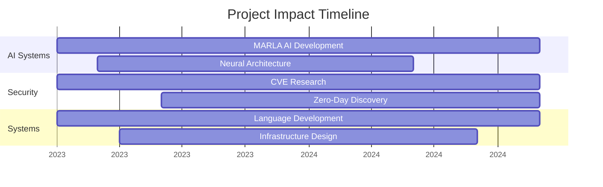

<div align="center">

# MARLA

### Architecting the Future: Advanced Systems & AI Innovation

[](https://git.io/typing-svg)

[](https://discord.gg/WJUheEQtuS)
[](https://bsky.app/profile/hxch.bsky.social)


</div>

---

## 🔮 Innovation at the Core

With over a decade of expertise in system architecture and AI development, I craft solutions that transform theoretical possibilities into practical, high-impact realities. My focus lies in building robust, scalable systems that push technological boundaries while ensuring enterprise-grade security and performance.

---

---

## 🎯 Core Projects

### ODIN AI
Next-gen AI platform with integrated security and intelligent automation
- Custom neural architectures
- Real-time threat detection
- Adaptive learning systems

### Network Fortress
Enterprise-grade security framework
- Zero-trust architecture
- Advanced threat detection
- Custom security protocols

### Custom Language Engineering
Specialized language for AI and security
- LLVM-based compiler
- Domain-specific optimizations
- Built-in security features

---

## 📊 Project Timeline



---

## 🌟 Achievements

- 🔍 50,000+ Critical CVEs Discovered
- 🤖 34+ Production AI Models Deployed
- 🛠️ Custom Programming Language Developed
- 🏆 Multiple Security Research Publications

---

## 💻 Development Environment

```yaml
OS: Windows 11 Pro
IDE: Custom Development Environment
Browser: Firefox (Security-Hardened Fork)
Tools: Custom Security Suite
```

---

<div align="center">

*"Engineering excellence through innovation, security by design."*

[Discord](https://discord.gg/WJUheEQtuS) • [Bluesky](https://bsky.app/profile/hxch.bsky.social)

</div>
